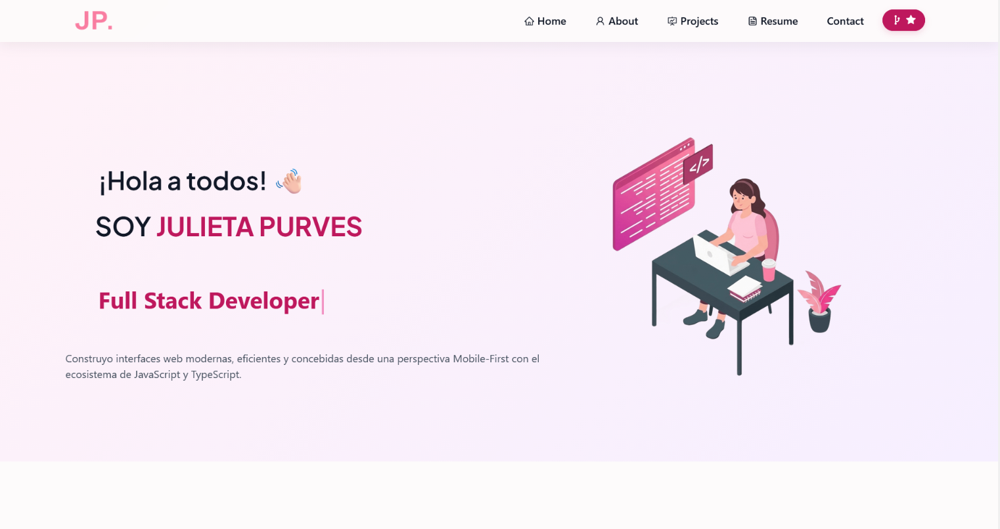

<h1 align="center">
  💖 Portfolio Personal - Julieta Purves <br/>
  <a href="https://portfolio-psi-seven-li6u99o5os.vercel.app/" target="_blank">Ver Proyecto Live ✨</a>
</h1>

<div align="center">
  
</div>

<p align="center">
  <b>Mi sitio web personal y portfolio profesional desarrollado con React.js.</b>
</p>

<center>

[](https://forthebadge.com) &nbsp;
[](https://forthebadge.com) &nbsp;

</center>

---

## 👩‍💻 Sobre el Proyecto

Bienvenido/a a mi portfolio personal. Este espacio fue diseñado para mostrar mis proyectos, habilidades técnicas, experiencia y mi trayectoria como **Full Stack Developer**. Cuenta con un diseño responsive, animaciones interactivas y un tema personalizado.

### 🛠️ Tecnologías Utilizadas

- **Frontend:** React.js, React-Bootstrap, FontAwesome, CSS3
- **Herramientas & Deploy:** Git, GitHub, VS Code, Vercel

---

## 🚀 Características

- **📱 Diseño 100% Responsive:** Adaptado perfectamente para celulares, tablets y computadoras.
- **🎨 Estética Personalizada:** Tema con paleta de colores a medida e interfaz cuidada.
- **📄 Descarga de CV:** Sección para visualizar y descargar mi curriculum vitae actualizado.
- **📫 Formulario de Contacto:** Vínculos directos a redes profesionales y contacto.

---

## 💻 Instalación y Configuración Local

Si querés probar este proyecto localmente en tu máquina:

1. **Clonar el repositorio:**
   ```bash
   git clone [https://github.com/JulietaPurves11/Portfolio.git](https://github.com/JulietaPurves11/Portfolio.git)